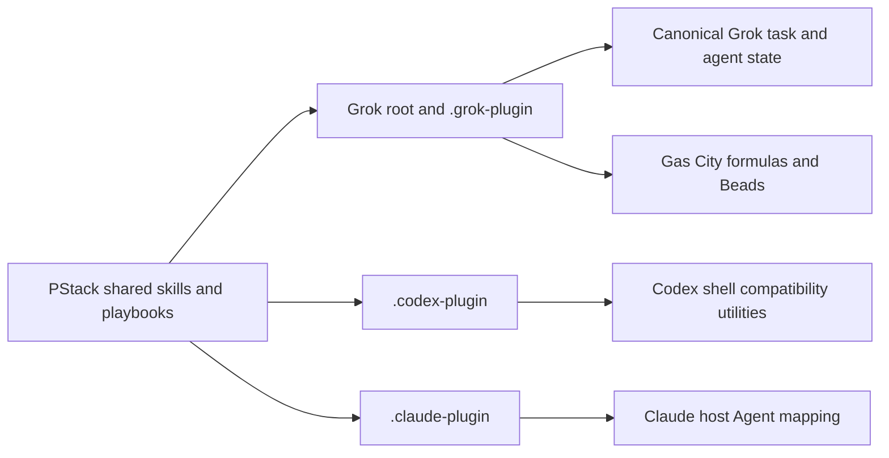

## Context

The live Grok path already uses `monitor`, `/loop` → `scheduler_create`, and
canonical host task/agent state. The repository also retains Codex compatibility
utilities under `skills/poteto-mode/scripts/`, including `orch` and `watch-pr`.
Those utilities are documented in `references/codex-tools.md` and are not loaded
by the Grok plugin manifest. The root and `.grok-plugin` manifests are the Grok
parity pair; `.codex-plugin` and `.claude-plugin` are separate host adapters and
intentionally do not expose Grok-only Benny automation skills.
The adjacent verify-and-ship guide still describes Babysit as using a bundled
watcher, while the maintained playbook requires the host `monitor` primitive.
That wording drift can send operators to a retired local watcher surface.

## Goals / Non-Goals

**Goals:**

- Make the Grok-only durable-state boundary explicit in durable specs and ADRs.
- Label retained `scripts/orch` and `watch-pr` utilities as Codex compatibility
  surfaces instead of contradicting the Grok claim.
- Lock root/`.grok-plugin` parity while documenting intentional Codex/Claude
  manifest asymmetry.
- Add tests that fail if the boundary wording or manifest policy drifts.
- Keep the verify-and-ship guide aligned with the maintained Babysit host primitive.

**Non-Goals:**

- Do not delete or rewrite retained Codex utilities.
- Do not add Benny skills to Codex or Claude manifests.
- Do not change Grok playbooks, spawn fields, scheduler behavior, plugin hooks,
  or provider/runtime dependencies.
- Do not claim live host execution from static manifest checks.

## Decisions

1. **Scope host-owned durable state to Grok.** Rewrite the accepted decision as a
   superseding ADR whose normative subject is the Grok playbook path. Keep the
   existing no-local-store behavior unchanged.
2. **Name the adapter boundary.** Add a short host-map note beside the existing
   Codex utility mapping. The note states that the utilities are not a Grok
   durable surface and are not loaded by `.grok-plugin`.
3. **Test intentional asymmetry.** Retain the existing root/`.grok-plugin`
   equality assertions. Add assertions that Codex and Claude retain `./skills/`
   and do not claim the Grok-only Benny path. This tests policy rather than
   forcing all manifests to be identical.
4. **Keep the current plugin files.** The manifests already encode the desired
   host split; only the explanatory contract and regression coverage change.
5. **Align operator guidance with the runtime boundary.** Replace the stale
   bundled-watcher sentence in the verify-and-ship guide with the host
   `monitor` wording already enforced by the Babysit playbook, and assert the
   boundary in the focused harness suite.

## Risks / Trade-offs

- A superseding ADR adds one durable record, but editing accepted ADR-0006 would
  destroy decision history.
- Codex and Claude may add equivalent Benny implementations later. Such a change
  needs its own host-specific intent and must not silently widen this parity rule.
- Static tests cannot prove a host has loaded a manifest. The existing
  `grok plugin validate` check remains the runtime-adjacent evidence boundary.

## Migration Plan

1. Commit the proposal artifacts on `main` before apply, per OpenSpec git
   discipline.
2. Add the superseding ADR, update the main host-boundary spec, add the host-map
   wording, and extend `tests/test_verify_harness.py`.
3. Run `python3 scripts/verify-harness.py`, the focused pytest suite including
   the guide-boundary assertion, and `grok plugin validate .`.
4. Roll back by reverting the documentation/test commit. No persistent data or
   plugin installation migration exists.

## Open Questions

- Whether a future Codex or Claude Benny automation should become a first-class
  adapter remains intentionally undecided; current manifests document absence.
