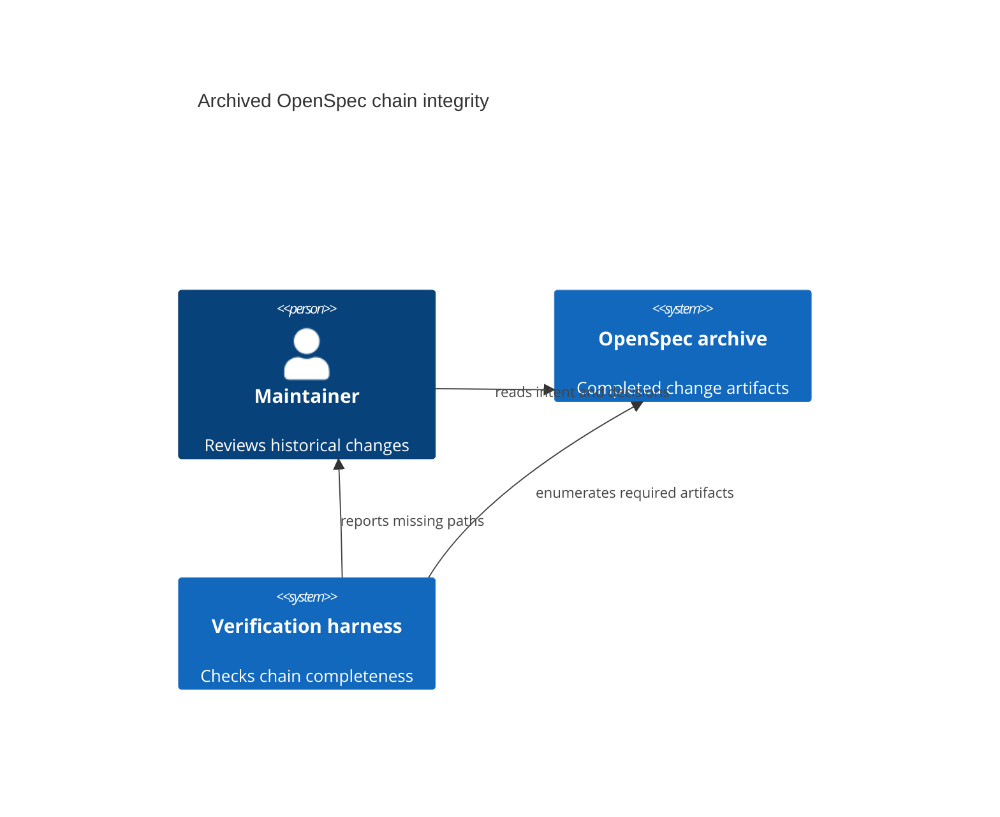

## Context

The repository uses the intent-driven OpenSpec schema. The current archive validator checks task completion and can validate the archive directories, but four historical entries were archived before the full artifact chain was present. Their proposals, specs, tasks, and metadata remain useful source evidence; only the design and ADR-review handoffs are absent.

## Goals / Non-Goals

**Goals:**

- Restore the missing artifact names in the four affected archives.
- Make the completeness rule executable in `tests/test_verify_harness.py`.
- Keep the repair auditable and clearly retrospective.

**Non-Goals:**

- Do not rewrite existing archived files.
- Do not re-run or re-archive historical changes.
- Do not change product code, plugin behavior, or the OpenSpec CLI.

## Decisions

### Retrospective artifacts

Add one design and one ADR-review manifest to each affected archive. Each design records the implemented boundary from the archive's own proposal/spec/task content and states that it is retrospective. Each ADR manifest records the relevant existing decisions and the fact that no new durable architectural decision is introduced by the repair.

### One completeness helper

Add a small pure helper to `tests/test_verify_harness.py` that enumerates immediate directories under `openspec/changes/archive/`, checks the six required artifact classes, and returns sorted missing paths. The test uses the real archive root so it cannot silently pass on a hand-listed subset.

## System Context

## Implementation Notes

1. Add the four design files and four ADR manifests without modifying existing archive content.
2. Add a test that asserts the repository's affected archives are complete and that a temporary missing design/ADR fixture fails with both paths.
3. Run the direct verification harness, focused pytest, strict OpenSpec validation, and the full local test module.

## Risks / Mitigations

- **Risk:** A future archive uses a different layout. **Mitigation:** the helper checks the contract explicitly and reports the path rather than silently accepting it.
- **Risk:** Retrospective prose is mistaken for original evidence. **Mitigation:** every added file labels the repair as retrospective and cites only existing archive material.
