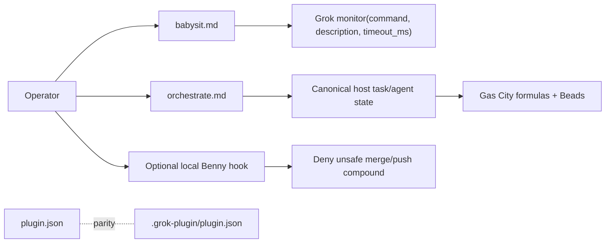

## Context

The Grok port has a verified host-native monitor contract in `HARNESS.md` and the existing babysit playbook already mentions `monitor` and `/loop` → `scheduler_create`, but it also tells operators to run the nonexistent `scripts/watch-pr/watch-pr` command. The orchestrate playbook similarly prescribes a nonexistent `scripts/orch/orch.ts` CLI and a private `orchestrate/<project-slug>/` database-like layout. Gas City methodology-pack guidance requires routing, retries, persistence, and fanout/fanin to remain in the Gas City graph and Beads rather than in an upstream prompt-local store.

The optional Benny guard is intentionally local and not a plugin hook. Its current deny patterns cover direct merge and force-push commands, including `--force-with-lease`, but a single command containing `git merge ... && git push ...` currently passes. The root manifest exposes the live Benny skill tree while the retained `.grok-plugin/plugin.json` metadata does not.

## Goals / Non-Goals

**Goals:**

- Make babysitting instructions executable against the documented Grok host primitives.
- Keep long-running orchestration state in canonical host task/agent state and preserve the Gas City/Beads boundary.
- Close the compound merge-and-push escape in the optional Benny guard.
- Make the two retained plugin manifests describe the same component surface.
- Leave small static and subprocess regression checks that fail on each repaired drift.

**Non-Goals:**

- Do not add a watcher, orchestration CLI, database, scheduler, or runtime dependency.
- Do not make the optional Benny guard a plugin-global hook or add Slack enforcement to it.
- Do not infer an unverified Grok status command; the host supplies a one-shot `monitor` command.
- Do not publish, push, archive this change, or claim live-host/remote evidence.

## Decisions

### 1. Use `monitor` as the only babysit watch boundary

Replace the repository-local watcher instructions with the documented host primitive. The playbook names the required `command`, `description`, and bounded `timeout_ms`; it does not prescribe a command path that this repository does not ship. Recurring checks remain `/loop` → `scheduler_create`, not a polling loop in the playbook.

**Alternative rejected:** adding a new `scripts/watch-pr` implementation. That would duplicate host functionality and create an untested runtime surface.

### 2. Keep durable orchestration state in the host graph

Remove the `scripts/orch` command and local store layout from the playbook. The coordinator publishes units, claims, frontier, verification, gates, and decisions through the host's canonical task/agent state. In a Gas City adapter, the concrete durable surfaces are Gas City formulas and Beads, which already own routing, retries, persistence, and fanout/fanin. Missing host fields become a gate or reported gap.

**Alternative rejected:** implementing a pstack-local store. It would create a second scheduler/database/session manager and conflict with Gas City's graph ownership.

### 3. Match compound safety patterns without broadening Slack policy

Keep direct merge and force-push matching unchanged, and add shell-glob cases for `git merge` followed by `git push` (and the reverse order) in the one command string received by the hook. The hook remains optional, local, and fail-closed only for the existing merge/push safety boundary; non-merge commands continue to allow.

**Alternative rejected:** denying every plain `git push` or every local `git merge`. That would exceed the existing hook contract and block ordinary project operations unrelated to the compound escape.

### 4. Treat the root manifest as runtime authority and retain lockstep adapter metadata

Set `.grok-plugin/plugin.json` component fields to the same values as the root manifest and test exact parity. Root `plugin.json` remains the manifest validated from the repository root; the overlay is metadata retained for adapter packaging and must not silently omit a live skill tree.

**Alternative rejected:** deleting the overlay without evidence that downstream packaging no longer consumes it. Parity is reversible and removes drift without destroying a possible adapter input.

## Architecture Flow

## Risks / Trade-offs

- [A host status command may differ by deployment] -> Keep the command as an explicit `monitor` input instead of naming a guessed repository script.
- [Static checks cannot prove a live Grok or Gas City deployment] -> Run the repository scanner, unit tests, and direct plugin validation; report live-host proof as out of scope.
- [Shell glob matching is intentionally narrow] -> Cover both command orders in tests and retain the existing direct force-push patterns; introduce a parser only if the hook receives structured command tokens in a future host contract.
- [A second retained manifest can drift again] -> Assert exact component parity in the harness test.

## Migration Plan

1. Add failing static/subprocess checks for the missing paths, compound guard, and manifest parity.
2. Update the two playbooks, local guard, and overlay metadata.
3. Run `python3 scripts/verify-harness.py`, `uv run --with pytest pytest -q tests/test_verify_harness.py`, and `grok plugin validate .`.
4. Keep the optional hook installation model unchanged; no persisted data migration exists because `scripts/orch` is not shipped.
5. Roll back by reverting this change; the root plugin contract and optional hook layout are otherwise unchanged.

## Open Questions

- The host supplies the concrete one-shot status command to `monitor`; this repository intentionally does not choose one.
- No in-force ADR requires supersession. The host-owned durable-state boundary is recorded as a new durable ADR for future playbook changes.
