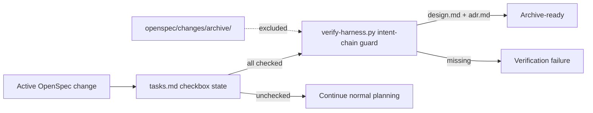

## Context

The active PStack durable specs still contain generated Purpose placeholders from archived changes. The placeholders do not invalidate OpenSpec, but they make the specification index less useful for audits and future changes. Separately, archived directories show that the CLI's strict validation does not require every historical change to retain `design.md` and `adr.md`.

The repository already runs `scripts/verify-harness.py` as a read-only static gate. It is the smallest existing boundary for a pre-archive check, and it can inspect task completion without adding an OpenSpec wrapper or runtime service.

## Goals / Non-Goals

**Goals:**

- Give each affected durable spec an accurate one-sentence Purpose.
- Fail the verification gate when an active task-complete change lacks `design.md` or `adr.md`.
- Make the guard testable with a temporary change tree.
- Leave archived historical artifacts untouched.

**Non-Goals:**

- Do not alter any requirement or scenario behavior.
- Do not retrofit missing artifacts into archived changes.
- Do not make incomplete planning changes fail the normal scanner.
- Do not add a dependency or invoke network, Grok, Gas City, or Beads at verification time.

## Decisions

### 1. Update Purpose only

Replace each generated `TBD` line with a concise description derived from the existing requirement headings and scenarios. No requirement blocks are copied or edited, so the change does not alter behavior contracts.

**Alternative rejected:** rewriting every spec requirement while touching Purpose. That would expand a hygiene repair into an unreviewable behavioral change.

### 2. Guard only task-complete active changes

The guard scans immediate child directories of `openspec/changes`, skips `archive`, and considers a change archivable only when `tasks.md` contains at least one checkbox and every checkbox is checked. It then requires `design.md` and `adr.md`. A change still being planned is not blocked by a gate intended for archive readiness.

**Alternative rejected:** requiring the artifacts for every newly created change. That would break the normal proposal-first workflow before the dependent artifacts can exist.

### 3. Keep the guard inside the existing harness

Expose a small pure helper from `verify-harness.py` and call it from `main()`. The test imports that helper against temporary directories containing checked, unchecked, and archived fixtures, proving both the positive failure and the exclusions.

**Alternative rejected:** a second archive wrapper script. The existing scanner is already the repository's executable static contract and adding another entrypoint would increase ceremony.

## Architecture Flow

## Risks / Trade-offs

- [A malformed task list may be treated as not archivable] -> Require at least one valid checkbox and leave malformed/no-task changes to OpenSpec's own validation.
- [Historical archives remain incomplete] -> Explicitly exclude `archive/` and document that the guard protects future archives only.
- [The scanner is static] -> Keep the check limited to artifact presence; OpenSpec strict validation remains a separate gate.
- [Purpose wording can drift] -> Derive each sentence from current requirements and include all twelve files in the focused review.

## Migration Plan

1. Add the fixture-backed guard test and run it red against a synthetic complete change missing design/ADR.
2. Implement the helper and call it from the scanner.
3. Replace the twelve generated Purpose lines.
4. Run the scanner, direct test script, focused pytest, and strict OpenSpec validation.
5. Rollback is a single revert; no user data or archived artifact changes are involved.

## Open Questions

None. The guard intentionally protects active changes only; archived historical completeness remains an audit finding rather than a migration requirement.
