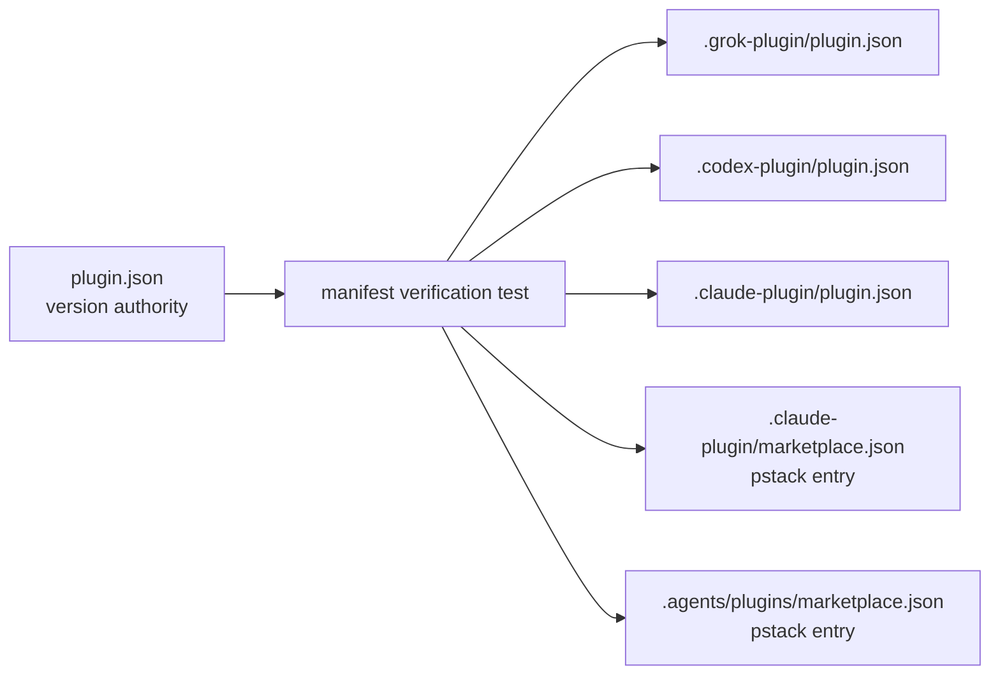

## Context

The published pstack adapter version is `0.14.7-grokbuild.0`. Root `plugin.json`, the Grok/Codex/Claude manifests, and `.claude-plugin/marketplace.json` already carry that value, but the tracked `.agents/plugins/marketplace.json` overlay remains at `0.14.5-grokbuild.3`. The audit found no runtime code issue; the defect is a stale tracked metadata surface that the current verification contract does not inspect.

The repository has host-specific manifest path boundaries. ADR-0008 requires the root and Grok manifests to remain in lockstep for Grok paths, while Codex and Claude may expose different supported paths. This change therefore synchronizes only the adapter version field, not manifest shape or host capability lists.

## Goals / Non-Goals

**Goals:**

- Make root `plugin.json` the authoritative adapter-version source.
- Keep the version field synchronized across all six tracked pstack manifest/index surfaces.
- Add a regression check that identifies the exact stale path and expected root version.
- Repair the known `.agents/plugins/marketplace.json` drift without widening the completed upstream-refresh history.

**Non-Goals:**

- Do not require identical skills, agents, or host-specific paths across manifests.
- Do not change the SemVer plus `-grokbuild.N` grammar or existing tags.
- Do not modify the sibling `grok-build-plugins` checkout or installed host state.
- Do not perform release, tag, push, marketplace-publishing, or installation actions.
- Do not add dependencies, runtime services, or a new ADR.

## Decisions

### Use an explicit tracked-surface map

The verification test will enumerate these paths and fields:

| Surface | Version field |
| --- | --- |
| `plugin.json` | `version` |
| `.grok-plugin/plugin.json` | `version` |
| `.codex-plugin/plugin.json` | `version` |
| `.claude-plugin/plugin.json` | `version` |
| `.claude-plugin/marketplace.json` | `plugins[name=pstack].version` |
| `.agents/plugins/marketplace.json` | `plugins[name=pstack].version` |

The map is intentionally explicit. It avoids treating unrelated catalog entries or host-specific manifest paths as pstack version sources.

### Compare against the root value, never a release literal

The test reads root `plugin.json` once, validates its existing SemVer adapter grammar through the current release tests, then compares every mapped surface to that value. Future version bumps will fail until every tracked surface is updated, without requiring another test edit for each release.

### Keep the implementation narrow

The implementation changes one stale JSON value and the existing verification test. No runtime loader, manifest schema, release script, or sibling catalog behavior changes. Durable `pstack-plugin-schema` synchronization happens after implementation verification.

### Data-flow view

## Risks / Trade-offs

- A new tracked manifest could be added later without entering the explicit map. The test failure and this table make additions review-visible; a future manifest addition must extend both together.
- The `.agents` index has no current live consumer documented in this repository. Keeping its version aligned is still safer than allowing a tracked published surface to advertise an obsolete adapter, and it preserves the historical lockstep intent.
- Version equality does not prove host compatibility. Existing host-specific schema checks and `grok plugin validate` remain responsible for capability and deserialization validation.

## Migration Plan

1. Validate this intent-driven change before implementation.
2. Add the manifest-map regression assertion and run it red against the stale `.agents` value.
3. Update `.agents/plugins/marketplace.json` to the root `plugin.json` version.
4. Run `python3 scripts/verify-harness.py`, the focused pytest suite, `tests/test_release.py`, and `grok plugin validate .`.
5. Sync the delta into the durable `pstack-plugin-schema` specification after implementation is verified.
6. Commit the metadata and test changes atomically; rollback is a normal revert of that commit.

No remote, sibling-repository, installed-host, tag, or release state changes are required.

## Open Questions

None. ADR-0008, ADR-0009, ADR-0010, and ADR-0011 remain applicable; the change adds no architectural decision that supersedes them.
