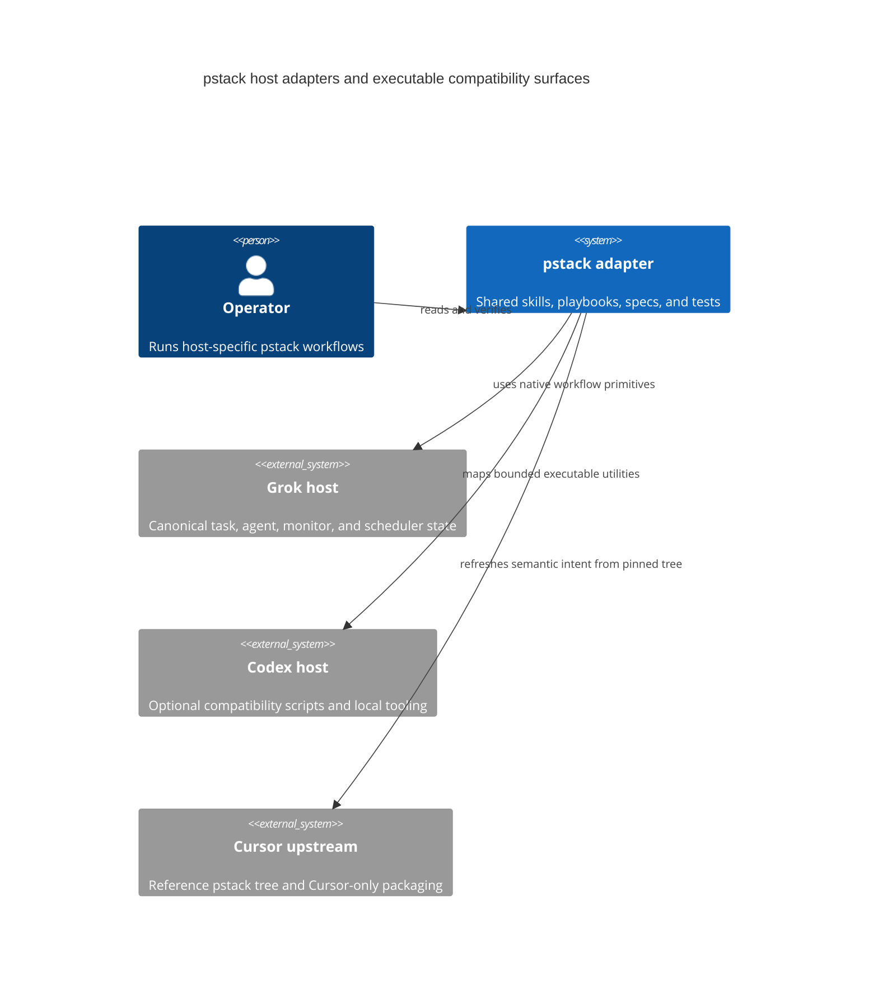

## Context

The port is a host adapter, not a byte-for-byte Cursor plugin mirror. `UPSTREAM` points at `efa2a531985e0a8084d36ff3cf87233be8a9f34b`; the live Cursor pstack tree is `93b00b89ef425a9c1bac0d0b317dfc49c930ac99`. The compare range contains a pstack `0.14.8` logo/manifest bump and two commits for a separate Cursor-only `advisor` plugin. No pstack skill, playbook, agent, or executable changed in that range.

The local tree retains upstream's Codex utilities. `orch` and `store` implement plain-file units, ledgers, inbox, gates, frontier, standing orders, status, atomic writes, and locking. `watch-pr`, `check-plan.mjs`, and `worktree-audit.sh` are executable compatibility surfaces. The Grok path already uses host-native task/agent state and MUST continue to avoid the local store.

ADR review covered every repository ADR. Supersession edges are `ADR-0003 -> ADR-0001`, `ADR-0004 -> ADR-0002`, and `ADR-0008 -> ADR-0006`. ADR-0001, ADR-0002, and ADR-0006 are superseded. ADR-0003, ADR-0004, ADR-0005, ADR-0007, ADR-0009, ADR-0010, and ADR-0011 are accepted and applicable. ADR-0008 contains the current host-boundary wording but is still marked `Proposed`; this change does not edit an accepted or proposed ADR and treats the durable Grok boundary spec plus host map as the operative contract.

## Goals / Non-Goals

**Goals:**

- Record the live upstream pin and adapter version lineage without importing Cursor packaging or a sibling plugin.
- Make the Codex executable inventory and ownership explicit, testable, and separate from Grok runtime state.
- Make recursive plan dependencies machine-readable and fail closed on malformed graphs.
- Preserve worktree and transcript evidence on Linux, BSD, missing remotes, and paths with spaces.
- Report a missing `gh` executable through the watcher's existing typed retry path.
- Keep focused tests small, behavioral, and runnable with the existing Bun/Python toolchain.

**Non-Goals:**

- Do not port `.cursor-plugin/`, `assets/logo.png`, or the separate `advisor` plugin into this adapter.
- Do not replace Graphite in the Codex-only `orch` frontier implementation or make it a Grok dependency.
- Do not create a Grok scheduler, database, session manager, or repository-local orchestration store.
- Do not add dependencies, change forge policy, change playbook verification lanes, tag a release, commit, push, or archive.
- Do not change prior ADR files or repair unrelated historical archive records.

## Decisions

### Refresh metadata, not excluded packaging

Update `UPSTREAM` to `93b00b89ef425a9c1bac0d0b317dfc49c930ac99`, record the three commits after the old pin, and state that the only pstack-specific delta is the upstream `0.14.8` packaging/logo bump. Set all six tracked manifest surfaces to `0.14.8-grokbuild.0`, following the `MAJOR.MINOR.PATCH-grokbuild.N` contract and resetting the adapter counter for the new upstream base. Keep `.cursor-plugin/`, `assets/logo.png`, and `advisor` explicitly excluded.

The sync recipe will classify unchanged executable paths as audit-and-adapt surfaces rather than blind-copy candidates. The sync script remains read-only and continues to update no port files.

### Keep executable tools Codex-only

The source files under `skills/poteto-mode/scripts/` remain in place because the Codex map references them. Add durable contract coverage and package test coverage, but do not route Grok playbooks through them. `orch/store` remains Graphite-specific at its frontier boundary; that limitation is documented rather than silently replaced with a second forge implementation.

### Validate a section graph in the existing checker

Use the existing H2 PR sections as graph nodes. A node title must end with `(identifier)`, where the identifier starts with a letter, digit, or `#` and continues with a non-whitespace token composed of letters, digits, `_`, `.`, `/`, `#`, or `-`. Its `**Depends on.**` rest is either `None.` or a comma-separated list of those identifiers. The checker builds a map, reports duplicate or unknown identifiers, and runs depth-first traversal with a visiting stack to report cycles. It prints `id=<identifier> depth=<n>` in each section's existing summary; depth is the longest dependency path below that node, with a root at zero.

This is a strict extension of the local host-adapted checker. The multi-phase plan skeleton will use a concrete `task-id` placeholder and explain the format, so authors no longer have to invent dependency syntax.

### Harden worktree evidence without changing its purpose

Keep `worktree-audit.sh` a read-only Codex/GitHub utility. Replace `$2` worktree parsing with line-preserving extraction. Establish `origin/main` only when its ref exists after the best-effort fetch; otherwise set `merged=unknown`. Resolve transcript root from `PSTACK_TRANSCRIPTS_DIR` when supplied, retaining the historical Cursor default only as a fallback. Read file mtimes through a GNU/BSD `stat` helper and a GNU/BSD date fallback while iterating transcript filenames without `xargs` field splitting.

### Normalize missing command errors

Add a `command-error` member to `QueryFailure`. When `spawn` emits `error`, `watch-pr` rejects a `WatcherQueryError` with a retryable bounded detail naming the command. Existing nonzero exits remain `command-exit`; no caller contract changes.

### Test the real entrypoints

Add Bun tests for the checker graph and worktree audit. The fixtures invoke the actual scripts and assert exit status and output fields. Add a real `GhGitHubReader` test with an empty `PATH` for missing `gh`. Extend the package test script to include the new checker and shell tests; keep the existing strict watcher typecheck.

### System boundary

## Risks / Trade-offs

- Strict graph identifiers make old plan sections without IDs invalid. This is intentional because a dependency field that is only prose cannot be checked; the skeleton and error messages provide the migration path.
- The Codex frontier remains Graphite-specific. Replacing it would be a separate forge-support project and would violate the host boundary; the contract makes the limitation visible.
- Transcript discovery still depends on a host-supplied root when the historical Cursor default is not present. `unknown` or `-` is safer than a fabricated liveness or merge conclusion.
- Upstream can add new pstack files after the recorded tree. `--log`, the explicit inventory, and the review checklist remain the detection path.
- The live compare includes a separate `advisor` plugin. It is not a pstack capability and its Cursor hook contract is incompatible with this adapter; it remains an intentional exclusion.

## Migration Plan

1. Update the intent artifacts and validate the change before source edits.
2. Refresh `UPSTREAM`, manifest versions, and the sync recipe.
3. Add the checker, watcher, and worktree tests first and observe the expected failures.
4. Implement the smallest source changes until the focused tests pass.
5. Update the host map and multi-phase plan documentation, then run the harness, package tests, typecheck, sync commands, and strict OpenSpec validation.
6. Review the diff for accidental Cursor packaging, Grok local state, Graphite requirements in Grok playbooks, or generated files. Leave commit, push, and archive actions to a separately authorized step.

Rollback is a normal revert of the changed metadata, scripts, tests, docs, and change artifacts. No remote, installed-plugin, database, or scheduler state is touched.

## Open Questions

- ADR-0008's `Proposed` status conflicts with its use as the current boundary wording. This change deliberately does not mutate immutable ADR history or introduce a contradictory decision. If the repository wants to mark that decision accepted, do so in a separate ADR-status maintenance change.
